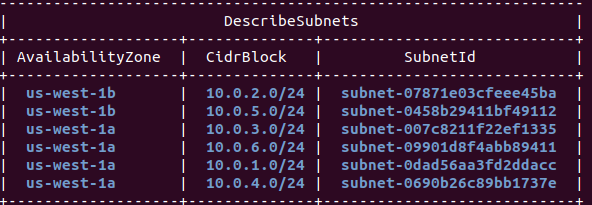
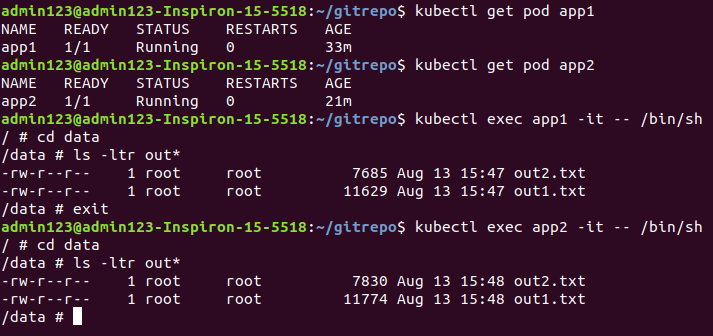

# Kubernetes-EKS-EFS
This repo contains steps to create an EFS file system and use it from AWS Kubernetes (EKS) Cluster Nodes

### Prerequisites
* Create an EFS EKS Cluster

<b>Step 1</b>

Update kubectl config to point to Dev EKS cluster

````
aws eks update-kubeconfig --name my-eks-cluster --region us-west-1 --role-arn arn:aws:sts::557884445442:role/eks-admin
````

<b>Step 2</b>

Execute below command to set the cluster name
````
CLUSTER_NAME=anj-eks-dev-1
````
<b>Step 3</b>

Execute below command to set the vpc id variable
````
VPC_ID=$(aws eks describe-cluster --name $CLUSTER_NAME --query "cluster.resourcesVpcConfig.vpcId" --output text)
````
<b>Step 4</b>

Execute below command to set the cidr block variable
````
CIDR_BLOCK=$(aws ec2 describe-vpcs --vpc-ids $VPC_ID --query "Vpcs[].CidrBlock" --output text)
````
<b>Step 5</b>

Execute below steps to create security group with an inbound rule that allows inbound traffic for your Amazon EFS mount points
````
MOUNT_TARGET_GROUP_NAME="eks-efs-mnt-group"

MOUNT_TARGET_GROUP_DESC="NFS access to EFS from EKS worker nodes"

MOUNT_TARGET_GROUP_ID=$(aws ec2 create-security-group --group-name $MOUNT_TARGET_GROUP_NAME 
                                                      --description "$MOUNT_TARGET_GROUP_DESC" 
                                                      --vpc-id $VPC_ID | jq --raw-output '.GroupId')

aws ec2 authorize-security-group-ingress --group-id $MOUNT_TARGET_GROUP_ID --protocol tcp --port 2049 --cidr $CIDR_BLOCK
````
<b>Step 6</b>

Execute below command to create an EFS File System
````
FILE_SYSTEM_ID=$(aws efs create-file-system | jq --raw-output '.FileSystemId')
````
<b>Step 7</b>

Execute below command to get the subnets
````
aws ec2 describe-subnets \
--filters "Name=vpc-id,Values=$VPC_ID" \
--query 'Subnets[*].{SubnetId: SubnetId,AvailabilityZone: AvailabilityZone,CidrBlock: CidrBlock}' \
--output table
````
Output should look like this -



<b>Step 8</b>

Execute below command to mount targets for the subnets that your nodes are in

````
aws efs create-mount-target \
--file-system-id $FILE_SYSTEM_ID \
--subnet-id subnet-07871e03cfeee45ba \
--security-groups $MOUNT_TARGET_GROUP_ID
````
 
````
aws efs create-mount-target \
--file-system-id $FILE_SYSTEM_ID \
--subnet-id subnet-007c8211f22ef1335 \
--security-groups $MOUNT_TARGET_GROUP_ID
````

<b>Step 9</b>
Create storage class

````
kubectl apply -f storage-class.yaml
````

<b>Step 10</b>
Create persistent volume

````
kubectl apply -f persistent-volume.yaml
````

<b>Step 11</b>
Create persistent volume claim

````
kubectl apply -f persistent-volume-claim.yaml
````

<b>Step 12</b>
Create Pod1 and mount above persistient volume to /data folder

````
kubectl apply -f pod1.yaml
````

<b>Step 13</b>
Create Pod1 and mount above persistient volume to /data folder

````
kubectl apply -f pod2.yaml
````

### Check if EKS Cluster Pods able to access the EFS or not



#### Note
As we can see Pod1 able to access out2.txt created by Pod2 and Pod2 able to access out1.txt created by Pod1.
